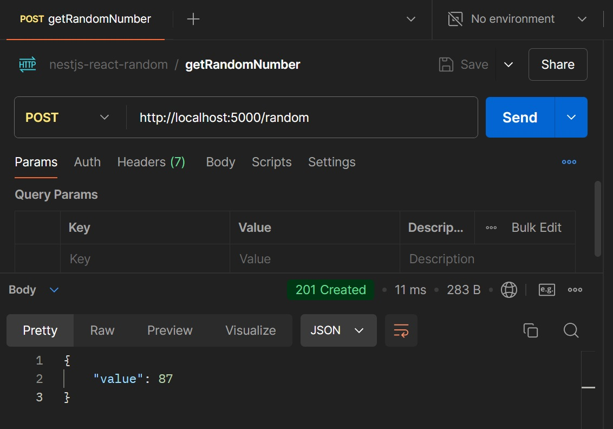

# Generación de Números Aleatorios con NestJS y React

Este proyecto implementa una aplicación web que genera números aleatorios entre 1 y 100, utilizando un backend en **NestJS** y un frontend en **React**. La aplicación también incluye una animación que muestra números que varían hasta llegar al valor generado aleatoriamente por el backend.

## Requisitos

- Node.js
- NestJS CLI
- React

## Estructura del Proyecto

El proyecto tiene dos carpetas principales:

- **backend/**: Contiene el servidor API desarrollado con NestJS.
- **frontend/**: Contiene la interfaz de usuario desarrollada con React.

## Instrucciones para ejecutar el proyecto

### 1. Clonar el repositorio

```bash
git clone https://github.com/julrios/nestjs-react-random-number-api
```

### 2. Instalar dependencias

```bash
npm install
```

#### Backend

```bash
cd backend
npm install
```

#### Frontend

```bash
cd ../frontend
npm install
```

### 3. Ejecutar el proyecto

El proyecto utiliza **`concurrently`** para ejecutar tanto el backend como el frontend simultáneamente. Volvé al directorio raíz:

```bash
cd ..
```

Desde el directorio raíz del proyecto, ejecutá el siguiente comando para iniciar el proyecto:

```bash
npm start
```

- El backend estará disponible en http://localhost:5000.
- El frontend estará disponible en http://localhost:3000.

## Interacción con la API

La API tiene un endpoint **`POST /random`** que genera un número aleatorio entre 1 y 100. Podés interactuar con la API directamente usando herramientas como Postman o desde el frontend a través del botón que realiza una solicitud.



## Funcionalidades del Frontend

- Un botón que al hacer click genera un número aleatorio llamando a la API.
- Una animación de números mientras se genera el número final.
- Visualización del número generado después de la animación.


## Documentación del código

### Backend

- **NestJS**: El backend está desarrollado utilizando el framework NestJS, con una ruta **`POST /random`** que genera y devuelve un número aleatorio en formato JSON: **`{ "value": <número> }`**.
- **Middleware**: El middleware registra la marca de tiempo de cada solicitud recibida.

### Frontend

- **React**: El frontend utiliza React para hacer solicitudes al backend y mostrar el número generado con una animación.
